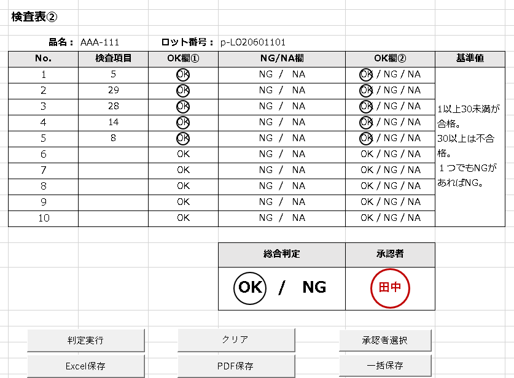
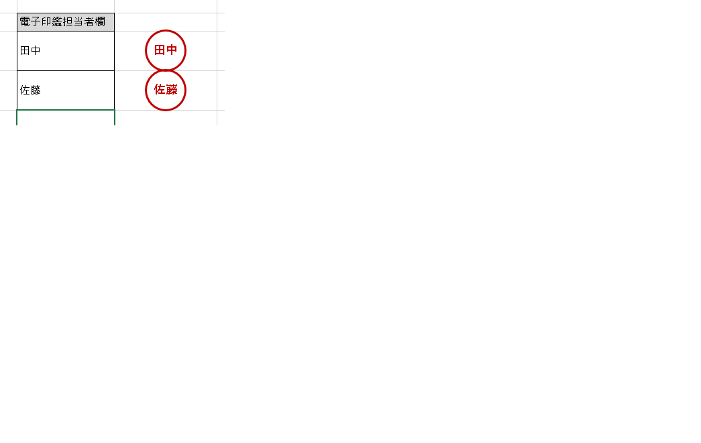

# 検査表2 — 検査表自動化ツール

> 本ツールは検査表自動化ツールの派生版です。要件の違いによって機能を分けて開発しており、他のバージョンも合わせてご覧ください。
> - [検査表2](https://github.com/kondo-works-lab/Inspection-sheets-checker2): 基本形
> - [検査表3](https://github.com/kondo-works-lab/Inspection-sheets-checker3): 品名によって検査項目が異なる仕様に対応

Excel VBAで作成した検査表業務の自動化ツールです。品名ごとに検査項目が異なる仕様に対応しています。

## 機能

- **入力チェック**: 検査表の入力内容をチェック
- **電子印鑑**: 電子印鑑の作成・押印
- **Excel保存**: 検査表をExcel形式で保存
- **PDF保存**: 検査表をPDF形式で保存(保存先フォルダを選択可能)
- **保存履歴**: 保存した検査表の履歴を管理

## シート構成

- `検査表`: 検査項目の入力・チェックを行うメインシート
- `電子印鑑`: 電子印鑑の作成・管理
- `保存履歴`: 保存履歴の記録

## 使用technology

- Excel VBA

## 使い方

1. `検査表2.xlsm` を開く(マクロを有効にする)
2. `検査表` シートで検査項目を入力
3. 承認者選択で電子印鑑を押印
4. Excel/PDF形式で保存

## スクリーンショット

### 検査表画面

### 電子印鑑

